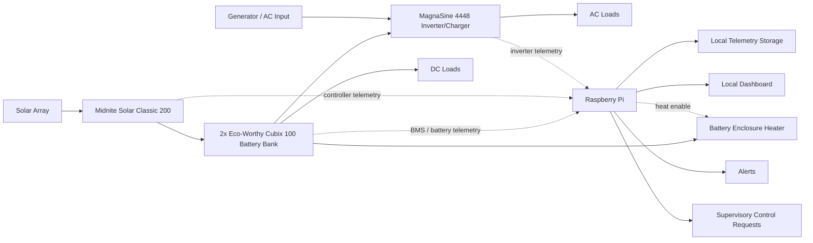

# Architecture

## System Overview

This project is organized around the major power-system subsystems that require telemetry, documentation, and possibly supervisory control:

- [Site](site.md): Wawa, Ontario installation context, time zone, and solar-noon calculation notes.
- [Battery bank](subsystems/battery-bank.md): 2x Eco-Worthy Cubix 100 48 V 100 Ah rack-mount batteries.
- [Solar charge controller](subsystems/charge-controller.md): legacy Midnite Solar Classic 200.
- [Battery temperature control](subsystems/battery-temperature-control.md): winter warming, warm-weather ventilation, and charge-temperature permissives.
- [Inverter/charger](subsystems/inverter-charger.md): MagnaSine 4448 inverter/charger.
- [Supervisory controller](subsystems/supervisory-controller.md): Raspberry Pi and local services.

## Major Subsystems

| Subsystem | Purpose | Notes |
|---|---|---|
| Battery bank | Stores DC energy and exposes battery/BMS state | 2x Eco-Worthy Cubix 100, 48 V, 100 Ah each |
| Charge controller | Converts solar array output into controlled battery charging | Midnite Solar Classic 200 |
| Inverter/charger | Converts 48 V DC to AC and charges from AC input when available | MagnaSine 4448 |
| Battery temperature control | Keeps batteries inside a safe temperature window | 48 V ceramic heater, insulated/ventilatable enclosure, thermostat, Pi permissive, thermal cutoffs |
| Supervisory controller | Reads telemetry, logs state, displays dashboard, and coordinates non-critical control | Raspberry Pi |
| Data services | Telemetry transport, database, dashboard, logs | Local-first SQLite with R2 store-and-forward; MQTT remains an optional live transport |

## Data Flow

1. Subsystem adapters read battery, charge controller, inverter/charger, and Pi health telemetry.
2. Measurements are normalized into named telemetry points.
3. Telemetry is stored locally, displayed, and optionally published to local transports.
4. During WAN windows, unsent metric samples are exported to object storage for later downstream import.
5. Alert rules evaluate measurements and notify operators.
6. Control policies evaluate state and request actuator changes only where explicitly documented.
7. Safety checks approve, reject, or force outputs to conservative states.

## Control Boundaries

Document which outputs the Pi is allowed to control and which safety functions are handled by dedicated hardware.

| Output | Controlled By | Default State | Manual Override | Notes |
|---|---|---|---|---|
| Battery protection | Battery BMS / hardware protection | Protected | Battery service procedures | Pi may monitor but should not be the primary safety device |
| Solar charging | Midnite Solar Classic 200 | Controller-managed | Charge controller front panel / breaker | Pi may monitor and possibly adjust non-critical settings later |
| AC inversion/charging | MagnaSine 4448 | Inverter-managed | Inverter controls / breakers | Pi may monitor and possibly request mode changes if supported |
| Battery heating | Thermostat / Pi permissive / hardware thermal cutoff | Off | Physical disconnect / fuse | Use low-power staged heat, not uncontrolled PV dump |
| Auxiliary loads | TBD relay/contactors | Off unless specified | Physical switch or breaker | Add only after wiring and fail-safe behavior are documented |

## LiFePO4 Charge Policy

The legacy charging equipment predates common LiFePO4 charge profiles. It may not understand that these batteries should not be held indefinitely at lead-acid-style float voltages. The supervisor therefore needs a system-level charge policy that watches every active charger, not just the solar charge controller.

Core policy intent:

- Allow bulk charging when the battery is below its normal full threshold and temperature permits charging.
- Allow absorb only long enough to complete a conservative LiFePO4 charge target.
- Avoid sustained float as the normal resting state.
- Disable equalization in normal operation.
- Treat any equalize-capable command path as manual-only unless a documented, non-LiFePO4 maintenance reason exists.
- Prefer charger rest, off, or reduced-voltage maintenance behavior after the bank is full.
- Re-enable charging only after SOC or voltage falls below a documented restart threshold.
- Alert if any charger enters equalize, or remains in float, absorb, or high-voltage output longer than the configured limit.

Candidate controlled chargers:

- Midnite Solar Classic 200 solar charge controller.
- Magnum 4448 inverter/charger when AC input or generator charging is available.

The exact implementation may differ per charger. The Classic may be managed through Modbus TCP if reliable write control is confirmed. The Magnum path may be managed through the ME-RC50/Magnum network only after passive telemetry and safe command behavior are verified. Until then, conservative manual settings and alerts are preferred over blind automated control.

## BMS Disconnect And Charger Transients

The BMS must be treated as last-ditch battery protection, not as the normal charge-control mechanism. If a lithium BMS opens while a legacy charger or MPPT controller is actively delivering current, the battery bus can experience a load-dump transient: the charger suddenly loses the battery as its voltage reference and energy sink.

Mitigation strategy:

- Keep charger voltage, current, absorb time, float behavior, equalization, and temperature limits conservative enough that the BMS should not need to open during normal operation.
- Use BMS telemetry, battery temperature, cell/battery voltage, and charger state to request charge reduction before a BMS cutoff threshold is reached.
- Prefer command-based charger shutdown first: Classic Mode Off or current-limit reduction for solar, Magnum charger standby/off for AC charging.
- If hardware interruption is required, interrupt the charger input/source side before opening the battery side: PV input before Classic battery output, AC/generator input before Magnum DC battery connection.
- Avoid opening a battery contactor or relying on the internal battery BMS while chargers are still actively pushing current.
- Alert on any BMS charge-disconnect, overvoltage, low-temperature charge inhibit, or unexpected battery disappearance during active charging.
- Consider DC-rated surge suppression as a secondary protective layer only; it does not replace proper charger inhibit sequencing.

Desired sequence for a charge-disallow event:

1. Supervisor sees approaching limit or BMS charge-not-allowed state.
2. Supervisor commands active chargers to stop or reduce current to zero.
3. Supervisor verifies charge current has fallen below a small threshold.
4. Only then may any downstream disconnect or contactor open.
5. Recovery requires charger state, battery voltage, temperature, and BMS status to be back inside the documented restart window.
