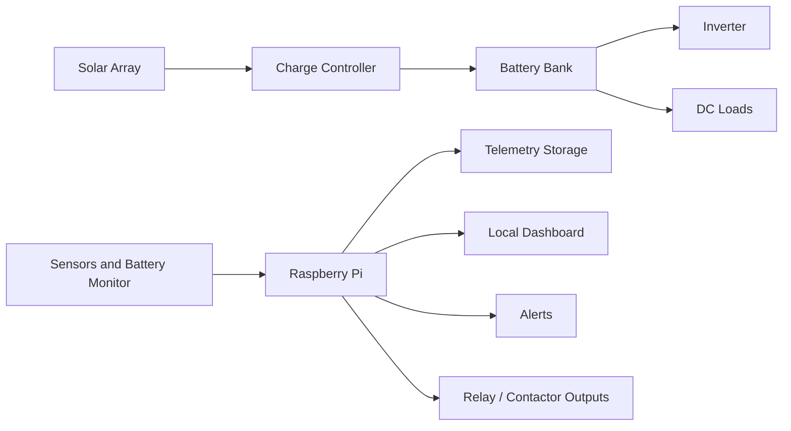

# Architecture

## System Overview

Describe the physical and software system here.

## Major Subsystems

| Subsystem | Purpose | Notes |
|---|---|---|
| Generation | Solar, generator, or other charging sources | Fill in model and electrical limits |
| Storage | Battery bank and BMS | Include chemistry, nominal voltage, capacity, and limits |
| Conversion | Inverter and DC/DC converters | Include continuous and surge ratings |
| Monitoring | Sensors, shunts, meters, networked devices | Include interface details |
| Control | Relays, contactors, low-voltage disconnects | Include fail-safe behavior |
| Data | MQTT, database, dashboard, logs | Include retention policy |

## Data Flow

1. Sensor adapters read field devices.
2. Measurements are normalized into named telemetry points.
3. Telemetry is published locally, stored, and displayed.
4. Alert rules evaluate measurements and notify operators.
5. Control policies evaluate state and request actuator changes.
6. Safety checks approve, reject, or force outputs to conservative states.

## Control Boundaries

Document which outputs the Pi is allowed to control and which safety functions are handled by dedicated hardware.

| Output | Controlled By | Default State | Manual Override | Notes |
|---|---|---|---|---|
| Example load relay | Raspberry Pi GPIO via relay board | Off | Physical switch in enclosure | Replace with real output |

